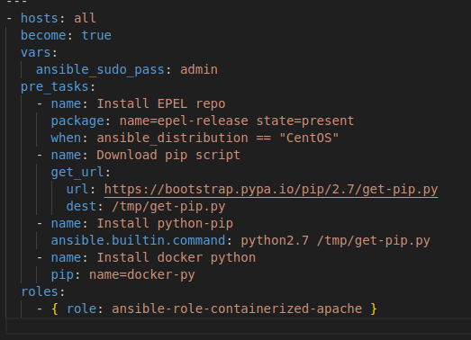
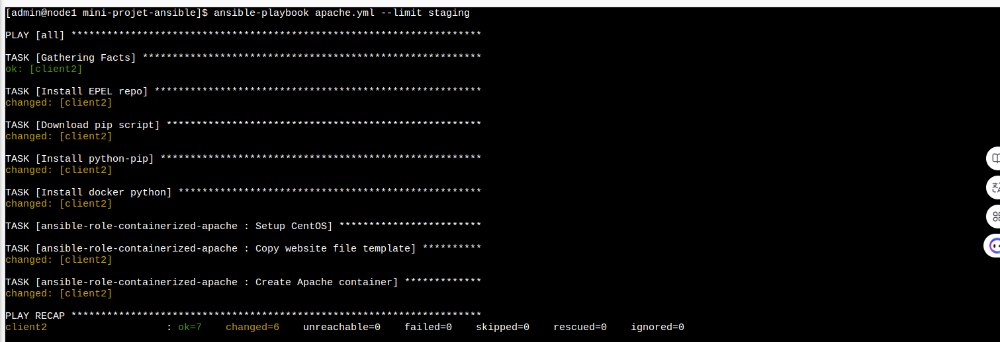

Rôle Ansible: Conteneurisation du serveur apache
=========

## Objectif
Nous allons créer un rôle Ansible pour déployer un serveur Apache conteneurisé.

La structure du rôle est la suivante :


## Test du role
Voici notre playbook de test :



Dans le fichier host_vars/client1.yml est spécifié l'adresse IP du serveur de production


Dans le fichier host_vars/client2.yml est spécifié l'adresse IP du serveur de staging


Ces adresse sont inclus dans le fichier d'inventaire host.yml comme vous pouvez le voir sur cette image ci-dessous.


### Déploiement

- ### Sur l'environnement de production

Pour déployer le serveur Apache conteneurisé, exécutez le playbook à l'aide de la commande suivante:

```bash
ansible-playbool apache.yml --limit prod
```
Client1 : Environnement de production


- ### Sur l'environnement de staging

Pour déployer le serveur Apache conteneurisé, exécutez le playbook à l'aide de la commande suivante:

```bash
ansible-playbool apache.yml --limit staging
```
Client2 : Environnement de staging





## Test du déploiement

Ouverture des ports :

Sur l'environnement eazylab, ouvrez le port 80 :

Depuis client1 pour l'environnement de production.


Depuis client2 pour l'environnement de staging.


## Conclusion

Ce mini-projet Ansible a permis d'explorer plusieurs concepts clés liés à l'automatisation de la configuration et du déploiement, notamment la création d'un rôle pour le déploiement d'un serveur Apache conteneurisé. À travers ce projet, j'ai acquis une meilleure compréhension de la gestion des rôles Ansible, de la configuration des services en conteneur, ainsi que de l'utilisation des playbooks pour orchestrer ces déploiements.
